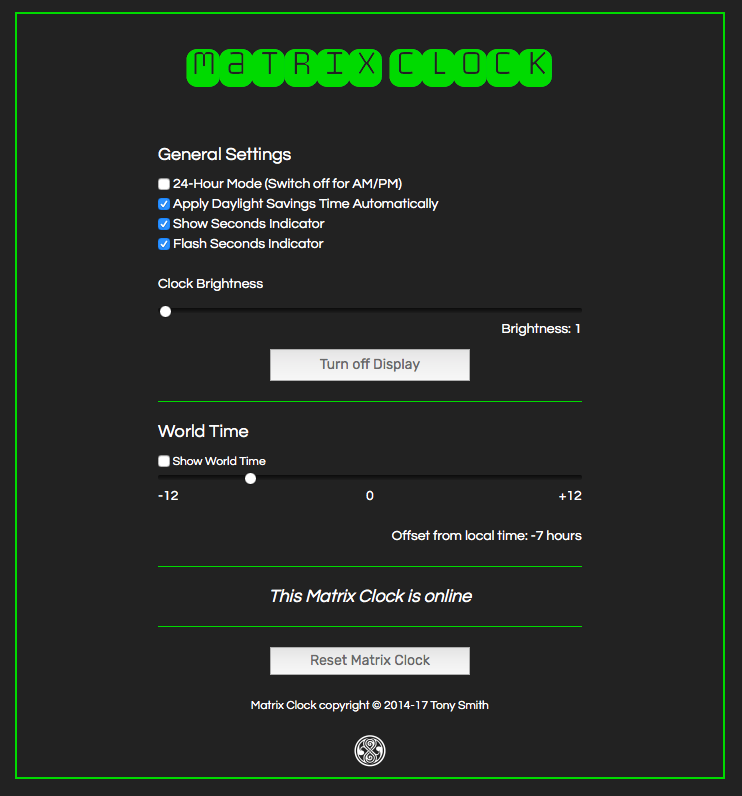

# MatrixClock 1.3

An [Electric Imp](https://electricimp.com/) imp001-based digital clock using four [Adafruit 8x8 LED matrix displays](http://www.adafruit.com/products/1854) based on the Holtek HT16K33 controller, embedded in a custom laser-cut acrylic case.

## Hardware

### Ingredients

- 1 x [Electric Imp Developer Kit](https://electricimp.com/docs/gettingstarted/devkits/)
- 4 x [Adafruit 1.2-inch 8x8 Square LED Matrix plus Backpack](http://www.adafruit.com/products/1854)
- 1x or 2x barrel jack
- 2x mini solder-less breadboards

### Circuit

The circuit shown is idealised. Power comes from the imp breakout board’s USB port (VIN). In practice, you will want to re-position the imp relative to the LED matrices, and I added to barrel jack power ports in parallel and positioned so that you can run a cable into the top of the clock or up to its base, depending on where you plan to site the clock. The jacks were wired directly to the GND and power rails, and from there to the imp board’s P+ and P- panels. The jumper on the board was adjusted accordingly.

### Assembly

If you use the laser-cut [casing](#casing), make sure you first place the faceplate face down, fit the LED matrices into the cut-out correctly, and then use a glue gun to fill the gaps between the faceplate and the matrices’ circuitboards, which overhang the LEDs by approximately 5mm. This will hold them in place while you assemble the circuit &mdash; you can then slot LEDs into the board, add the side plates and finally glue on the backplate.

### Setup

You’ll need to visit [Electric Imp](https://ide.electricimp.com/login/) to sign up for a free developer account. You will be asked to confirm your email address.

Visit Electric Imp’s [Getting Started Guide](https://electricimp.com/docs/gettingstarted/blinkup/) to learn how to configure your imp001 to access your local WiFi network, and how to enter code into the IDE and run it on your device.

## Usage

### UK/US Usage

The Matrix Clock device code is currently hardwired for UK usage: it adjusts to British Summer Time (BST) and back to Greenwich Mean Time (GMT) as appropriate. To do so, it makes use of Electric Imp’s [Utilities library](https://electricimp.com/docs/libraries/utilities/utilities/) and its *bstCheck()* function. This call can be replaced with the *dstCheck()* function if you wish to use a Matrix Clock in the US. This change will cause the clock to adjust to US Daylight Savings Time.

### Control UI

The Matrix Clock can be controlled by accessing its agent URL.

## Casing

You can use the file `clock.svg` to produce a simple laser-cut case/mounting frame for the Matrix Clock.

## Release Notes

### 1.3

- Add support for world time display, including web UI controls
- Add favicon and iOS home page icon

### 1.2

- Add web UI controls

### 1.1

- Initial public release

## Licence

The design and software for Matrix Clock are made available under the [MIT Licence](./LICENSE).

Copyright 2016-2017, Tony Smith
