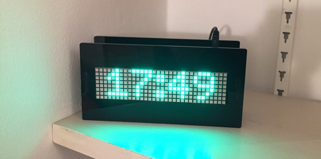
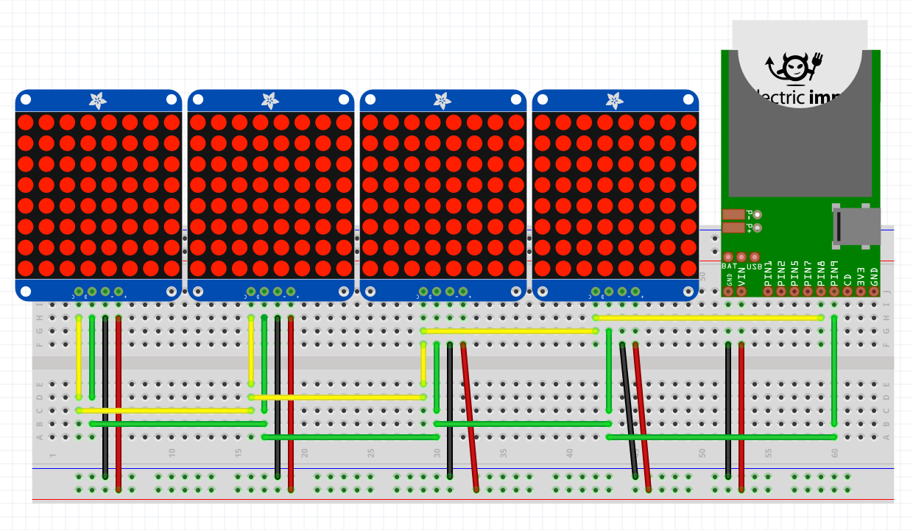
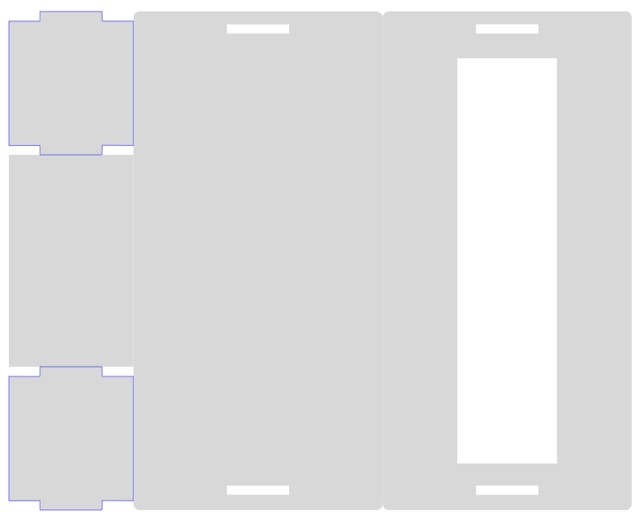

# MatrixClock 1.1

An [Electric Imp](https://electricimp.com/) imp001-based digital clock using four [Adafruit 8x8 LED matrix displays](http://www.adafruit.com/products/1854) based on the Holtek HT16K33 controller, embedded in a custom laser-cut acrylic case.

## Hardware

<p></p>

### Ingredients

- 1 x [Electric Imp Developer Kit](https://electricimp.com/docs/gettingstarted/devkits/)
- 4 x [Adafruit 1.2-inch 8x8 Square LED Matrix plus Backpack](http://www.adafruit.com/products/1854)
- 1x or 2x barrel jack
- 2x mini solder-less breadboards

### Circuit

<p></p>

The circuit shown is idealised. Power comes from the imp breakout board’s USB port (VIN). In practice, you will want to re-position the imp relative to the LED matrices, and I added to barrel jack power ports in parallel and positioned so that you can run a cable into the top of the clock or up to its base, depending on where you plan to site the clock. The jacks were wired directly to the GND and power rails, and from there to the imp board’s P+ and P- panels. The jumper on the board was adjusted accordingly.

### Assembly

If you use the laser-cut [casing](#casing), make sure you first place the faceplate face down, fit the LED matrices into the cut-out correctly, and then use a glue gun to fill the gaps between the faceplate and the matrices’ circuitboards, which overhang the LEDs by approximately 5mm. This will hold them in place while you assemble the circuit &mdash; you can then slot LEDs into the board, add the side plates and finally glue on the backplate.

### Setup

You’ll need to visit [Electric Imp](https://ide.electricimp.com/login/) to sign up for a free developer account. You will be asked to confirm your email address.

Visit Electric Imp’s [Getting Started Guide](https://electricimp.com/docs/gettingstarted/blinkup/) to learn how to configure your imp001 to access your local WiFi network, and how to enter code into the IDE and run it on your device.

## Usage

### UK/US Usage

The Matrix Clock device code is currently hardwired for UK usage: it adjusts to British Summer Time (BST) and back to Greenwich Mean Time (GMT) as appropriate. To do so, it makes use of Electric Imp’s [Utilities library](https://electricimp.com/docs/libraries/utilities/utilities/) and its *bstCheck()* function. This call can be replaced with the *dstCheck()* function if you wish to use a Matrix Clock in the US. This change will cause the clock to adjust to US Daylight Savings Time.

### URL Query Commands

The Matrix Clock can be controlled by passing URL queries to the agent. The commands are:

#### getmode

This returns a Matrix Clock’s current settings as a decodable string in the form:

```
1.1.1.1.01.1.01.1.d
```

Each period-separated unit is a settings value, as follows:

- Clock mode: 24-hour clock (1) or 12-hour clock (0)
- Daylight Savings Time state on (1) or off (0)
- Is the hours:minutes separator colon flashing (1) or not (0)
- Is the hours:minutes separator colon visible (1) or not (0)
- The display brightness (00-15)
- Is an international (ie. non-local) time being displayed (1) or not (0)
- International time offset (00-24, mapping in device code to offset values of +12 to -12)
- Is the display on (1) or off (0)

.d is *only* added if the agent detects that a Matrix Clock is not online when this command is issued.

#### reset

Resets a Matrix Clock to its default settings: 24-hour mode; Daylight Savings set according to current date; local time displayed; display on and at maximum brightness; colon visible and flashing.

#### setmode

Sets the clock mode: `setmode=1` 24-hour clock, or `setmode=0` 12-hour clock.

#### setutc

Sets the clock to a secondary, international time: `setutc=1.xx`, or back to local time `setutc=0`.

The value of the substring `xx` is the hour offset from local time that you require. Pass a value of `00` to `24`, where `00` is 12 hours behind local, `12` is local time and `24` is 12 hours ahead. As you can see, the device code converts the passed string to an integer and then subtracts 12 from it to gain the actual offset.

#### setbright

Sets the clock display brightness: `?setbright=xx`.

The value of the substring `xx` is the brightness value. Pass a value of `00` to `15`, where `00` is minimum brightness (not off) and `15` is the maximum.

#### setcolon

Sets the hour:minute colon display state: `setcolon=1` colon visible, or `setcolon=0` colon hidden.

#### setflash

Sets the hour:minute colon flash state: `setflash=1` colon flashing, or `setcflash=0` colon not flashing. Note that this setting has no visible effect it the colon is hidden using `setcolon=0`, but will take effect if the colon is subsequently made visible.

#### setlight

Controls the display state: `setlight=1` display is on, or `setlight=0` display is off.

You can use this to disable the display overnight, for example.

## Casing

You can use the file `clock.svg` to produce a simple laser-cut case/mounting frame for the Matrix Clock.

[](clock.svg)

## Licence

The design and software for Matrix Clock are made available under the [MIT Licence](./LICENSE).

Copyright 2016-2017, Tony Smith
