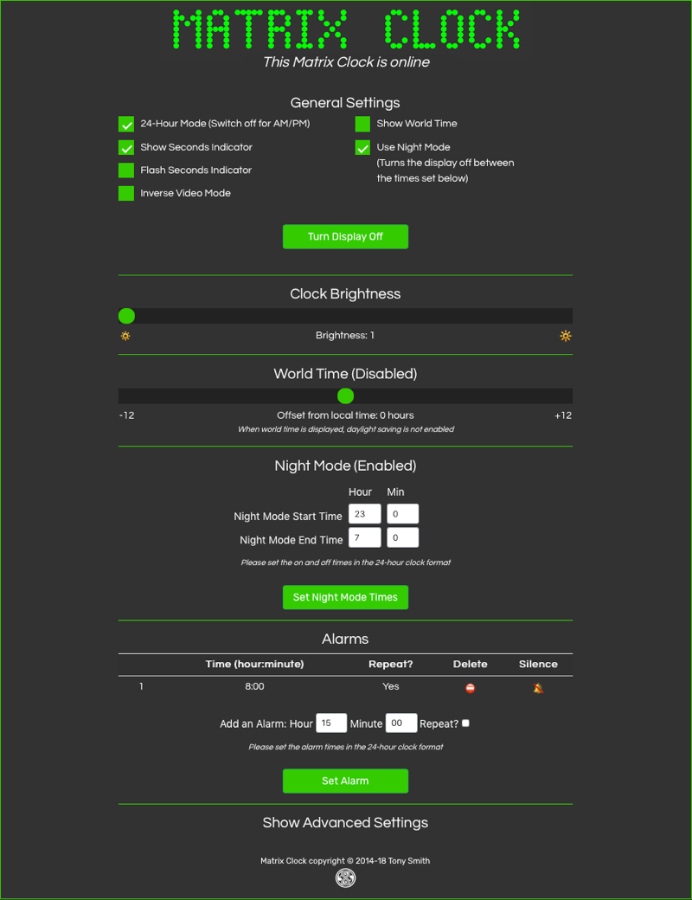

# MatrixClock 2.0.0 #

An [Electric Imp](https://electricimp.com/) imp001-based digital clock using four [Adafruit 8x8 LED matrix displays](http://www.adafruit.com/products/1854) based on the Holtek HT16K33 controller, embedded in a custom laser-cut acrylic case.

## Hardware ##

### Ingredients ##

- 1 x [Electric Imp Developer Kit](https://developer.electricimp.com/gettingstarted/devkits)
- 4 x [Adafruit 1.2-inch 8x8 Square LED Matrix plus Backpack](http://www.adafruit.com/products/1854)
- 1x or 2x barrel jack
- 2x mini solder-less breadboards

### Circuit ###

The circuit shown is idealised. Power comes from the imp breakout board’s USB port (VIN). In practice, you will want to re-position the imp relative to the LED matrices, and I added to barrel jack power ports in parallel and positioned so that you can run a cable into the top of the clock or up to its base, depending on where you plan to site the clock. The jacks were wired directly to the GND and power rails, and from there to the imp board’s P+ and P- panels. The jumper on the board was adjusted accordingly.

### Assembly ###

If you use the laser-cut [casing](#casing), make sure you first place the faceplate face down, fit the LED matrices into the cut-out correctly, and then use a glue gun to fill the gaps between the faceplate and the matrices’ circuitboards, which overhang the LEDs by approximately 5mm. This will hold them in place while you assemble the circuit &mdash; you can then slot LEDs into the board, add the side plates and finally glue on the backplate.

### Setup ###

You’ll need to visit [Electric Imp](https://impcentral.electricimp.com/login) to sign up for a free developer account. You will be asked to confirm your email address.

Visit Electric Imp’s [Getting Started Guide](https://developer.electricimp.com/gettingstarted/blinkup) to learn how to configure your imp001 to access your local WiFi network, and how to enter code into impCentral and run it on your device.

## Usage ##

### UK/US Usage ###

The Matrix Clock device code is currently hardwired for UK usage: it adjusts to British Summer Time (BST) and back to Greenwich Mean Time (GMT) as appropriate. To do so, it makes use of Electric Imp’s [Utilities library](https://developer.electricimp.com/libraries/utilities/utilities) and its *bstCheck()* function. This call can be replaced with the *dstCheck()* function if you wish to use a Matrix Clock in the US. This change will cause the clock to adjust to US Daylight Savings Time.

### Control UI ###

The Matrix Clock can be controlled by accessing its agent URL:

## Casing ###

You can use the file `clock.svg` to produce a simple laser-cut case/mounting frame for the Matrix Clock.

## Release Notes ##

- 2.0.0 &mdash; *In Development*
    - Restructure API to use JSON
    - Improved [Apple Watch Controller](https://github.com/smittytone/Controller) support
    - Improved error handling
    - Improved settings handling
    - Improved web UI code
- 1.6.0 &mdash; *11 September 2018*
    - Add ‘Advanced Settings’ area to UI and move Reset button into it
    - Add Debug checkbox to Advanced Settings
- 1.5.0 &mdash; *7 June 2018*
    - Update to [Bootstrap 4.1.1](https://getbootstrap.com/)
        - Update Web UI based on Bootstrap
        - Separate out Web UI code into own file for clarity
    - Use [DisconnectionManager](https://github.com/smittytone/generic/blob/master/disconnect.nut)
    - Update to [JQuery 3.3.1](https://jquery.com)
    - Prevent Ajax XHR cacheing
- 1.4.0
    - Minor changes; bringing everything up to date
- 1.3.0
    - Add support for world time display, including web UI controls
    - Add favicon and iOS home page icon
- 1.2.0
    - Add web UI controls
- 1.1.0
    - Initial public release

## Licence ##

The design and software for Matrix Clock are made available under the [MIT Licence](./LICENSE).

Copyright 2016-2018, Tony Smith
